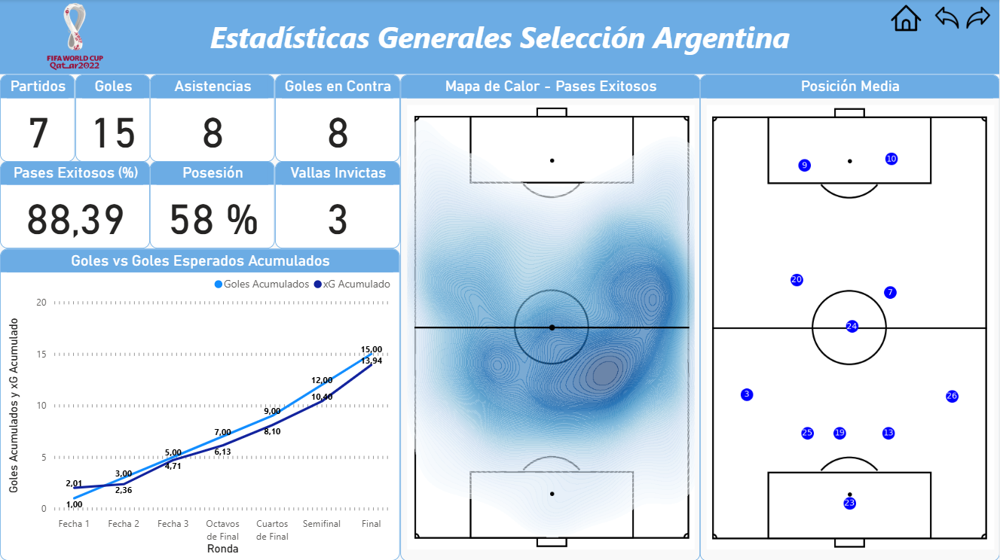
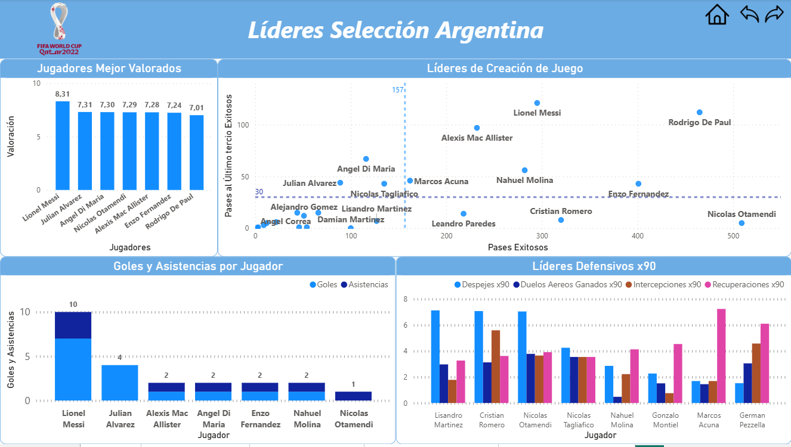
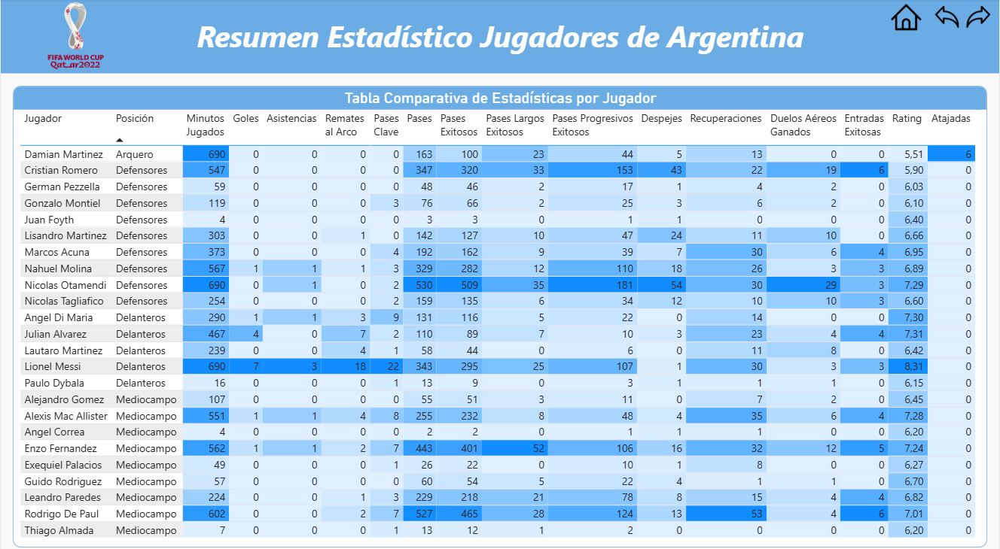
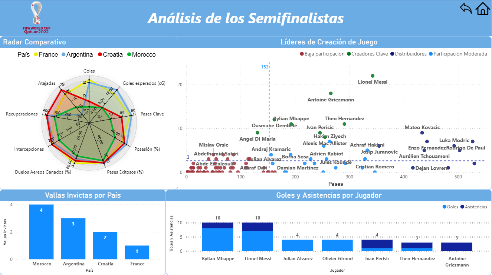

#  Master Thesis – Argentina National Team Analysis (Qatar 2022)

This repository contains my **Master Thesis project** for the Master's Degree in Sports Big Data (UCAM & Sports Data Campus).  
The work focuses on the **analysis of Argentina's performance in the FIFA World Cup Qatar 2022** using BEPRO datasets, Google Colab, and Power BI.

---

##  Repository structure

- **`notebooks/`** → Google Colab Notebook (`.ipynb`) with the data analysis.  
- **`dashboards/`** → Power BI dashboard (`.pbix`).  
- **`screenshots/`** → PNG images of the dashboard for quick preview.  

---

## 🛠 Tools used

- **Google Colab (Python)** → data cleaning and exploratory analysis.  
- **Power BI** → interactive dashboard design.  
- **CSV datasets (BEPRO)** → match events, players, and stats.  

---

##  Dashboard preview

Here you can see some of the main views of the Power BI dashboard:  

  

---

##  Objectives

1. Analyze Argentina’s performance across matches using BEPRO datasets.  
2. Build key KPIs and tactical insights through data visualization.  
3. Combine Python + BI tools to generate actionable conclusions.  

---

##  Files

- [Colab Notebook: Argentina Qatar 2022 Analysis](notebooks/notebooksargentina_qatar2022_analysis.ipynb)  
- [Power BI Dashboard (.pbix)](dashboards/dashboardsargentina_qatar2022.pbix)  

---

##  Author

**Julián Mantero**  
- [LinkedIn](https://www.linkedin.com/in/juli%C3%A1n-mantero/)  
- Telegram: `@julimantero`  
- GitHub: [@julimantero](https://github.com/julimantero)  
